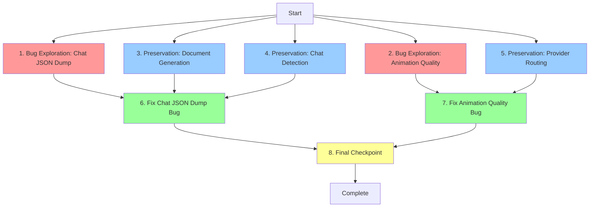

# Implementation Plan

## Overview

This implementation plan follows the bugfix exploratory workflow using the bug condition methodology to fix two critical bugs in the Strut animation system:

1. **Chat JSON Dump Bug**: Conversational inputs incorrectly expose raw JSON to the chat interface
2. **Animation Quality Bug**: Local CLI adapters fail to propagate premium animation instructions

The workflow proceeds in phases:
- **Phase 1**: Write exploration tests to demonstrate bugs exist on unfixed code (tests WILL FAIL)
- **Phase 2**: Write preservation tests to capture baseline behavior on unfixed code (tests WILL PASS)
- **Phase 3**: Implement fixes and verify bugs are resolved (exploration tests now PASS)
- **Phase 4**: Final validation ensuring all tests pass and no regressions

## Tasks

### Phase 1: Bug Condition Exploration (Test BEFORE Fix)

- [x] 1. Write bug condition exploration test for Chat JSON Dump bug
  - **Property 1: Bug Condition** - Chat Mode Returns Raw JSON
  - **CRITICAL**: This test MUST FAIL on unfixed code - failure confirms the bug exists
  - **DO NOT attempt to fix the test or the code when it fails**
  - **NOTE**: This test encodes the expected behavior - it will validate the fix when it passes after implementation
  - **GOAL**: Surface counterexamples that demonstrate the bug exists
  - **Scoped PBT Approach**: Test conversational inputs ("hi", "hello", "how does X work") with mocked LLM returning malformed JSON
  - Test implementation: Create integration test that sends conversational message through `assistant_message` with local CLI provider
  - Mock LLM to return malformed JSON instead of conversational text
  - Assert that `parse_assistant_result_from_text()` fails (expected on unfixed code)
  - Assert that fallback logic returns `AssistantResult::Chat` with raw JSON text (BUG - this is the defect)
  - The test assertions encode expected behavior: `AssistantResult::Chat` should contain natural language, NOT raw JSON
  - Run test on UNFIXED code
  - **EXPECTED OUTCOME**: Test FAILS (confirms bug exists - raw JSON exposed in chat interface)
  - Document counterexamples found: specific inputs that trigger JSON dump
  - Mark task complete when test is written, run, and failure is documented
  - _Bug_Condition: isBugCondition(input) where (classify_request_intent(input) == Conversation OR context.response_mode == "chat") AND LLM returns malformed JSON_
  - _Expected_Behavior: result is AssistantResult::Chat AND result.message contains natural language (no raw JSON) AND no JSON parsing attempted_
  - _Requirements: 1.1, 1.2, 1.3, 2.1, 2.2, 2.3, 2.4_

- [x] 2. Write bug condition explorawtion test for Animation Quality bug
  - **Property 1: Bug Condition** - System Prompt Not Propagated
  - **CRITICAL**: This test MUST FAIL on unfixed code - failure confirms the bug exists
  - **DO NOT attempt to fix the test or the code when it fails**
  - **NOTE**: This test encodes the expected behavior - it will validate the fix when it passes after implementation
  - **GOAL**: Surface counterexamples that demonstrate system prompt loss
  - **Scoped PBT Approach**: Test animation generation requests with local CLI adapters (Gemini CLI)
  - Test implementation: Create integration test that sends animation generation request through local CLI path
  - Instrument `chat_with_local_adapter` to capture received `system_prompt` parameter
  - Instrument `run_local_cli_command` to capture actual prompt sent to CLI process
  - Assert that `system_prompt` parameter is received (it is passed)
  - Assert that `GENERATION_PLAN_SYSTEM_PROMPT` is NOT included in CLI invocation (BUG - this is the defect)
  - Assert that Gemini CLI receives hardcoded "--prompt" arg instead of full prompt (BUG)
  - The test assertions encode expected behavior: CLI should receive full `GENERATION_PLAN_SYSTEM_PROMPT`
  - Run test on UNFIXED code
  - **EXPECTED OUTCOME**: Test FAILS (confirms bug exists - system prompt lost in pipeline)
  - Document counterexamples: trace prompt values at each pipeline stage
  - Mark task complete when test is written, run, and failure is documented
  - _Bug_Condition: isBugCondition(input) where provider.mode == "local" AND classify_request_intent(input) == Generate_
  - _Expected_Behavior: combined_prompt includes GENERATION_PLAN_SYSTEM_PROMPT AND run_local_cli_command receives full system_prompt AND Gemini CLI does NOT use hardcoded --prompt arg_
  - _Requirements: 2.1, 2.2, 2.3, 2.4, 2.5, 2.6, 2.7, 2.8_

## Phase 2: Preservation Property Tests (Test on UNFIXED code)

- [x] 3. Write preservation property test for Document Generation flow
  - **Property 2: Preservation** - Document Generation Preserved
  - **IMPORTANT**: Follow observation-first methodology
  - Observe: On UNFIXED code, send "create a coin flip animation" → system classifies as Generate → calls provider → parses Strut document JSON → returns AssistantResult::DocumentCreated → renders in preview
  - Write property-based test: For all valid animation generation requests with valid JSON responses, system returns DocumentCreated/DocumentUpdated
  - Test implementation: Create test that generates various animation requests ("create X animation", "make Y sprite")
  - Mock LLM to return valid Strut document JSON
  - Assert result is `AssistantResult::DocumentCreated` or `AssistantResult::DocumentUpdated`
  - Assert document is parsed correctly
  - Assert preview panel would receive document for rendering
  - Property-based testing generates many animation request variations
  - Run test on UNFIXED code
  - **EXPECTED OUTCOME**: Test PASSES (confirms baseline document generation works)
  - Mark task complete when test is written, run, and passing on unfixed code
  - _Preservation: For all inputs where classify_request_intent(input) == Generate AND LLM returns valid JSON, behavior unchanged_
  - _Requirements: 3.1, 3.2, 3.3_

- [x] 4. Write preservation property test for Chat Mode Detection
  - **Property 2: Preservation** - Chat Detection Preserved
  - **IMPORTANT**: Follow observation-first methodology
  - Observe: On UNFIXED code, send "how does X work" → system uses chat_system_prompt → provides conversational response (when LLM cooperates)
  - Observe: On UNFIXED code, context with response_mode="chat" → forces chat mode
  - Write property-based test: For all brainstorming/explanation queries with valid chat responses, system uses chat mode
  - Test implementation: Create test with queries like "how does the workspace work", "explain sprite sheets"
  - Mock LLM to return natural language (not JSON)
  - Assert system uses `chat_system_prompt`
  - Assert result is `AssistantResult::Chat` with conversational text
  - Test with explicit context `response_mode: "chat"` variations
  - Property-based testing generates many conversational query variations
  - Run test on UNFIXED code
  - **EXPECTED OUTCOME**: Test PASSES (confirms baseline chat detection works when LLM cooperates)
  - Mark task complete when test is written, run, and passing on unfixed code
  - _Preservation: For all brainstorming/explanation inputs AND response_mode="chat" contexts, chat mode detection unchanged_
  - _Requirements: 3.4, 3.5_

- [x] 5. Write preservation property test for Provider Routing
  - **Property 2: Preservation** - Provider Paths Preserved
  - **IMPORTANT**: Follow observation-first methodology
  - Observe: On UNFIXED code, BYOK providers correctly pass system_prompt via byok_generate_text
  - Observe: On UNFIXED code, Ollama HTTP includes GENERATION_PLAN_SYSTEM_PROMPT in API request
  - Observe: On UNFIXED code, sprite-python uses deterministic generation pipeline
  - Write property-based test: For all BYOK/Ollama/sprite-python requests, system prompt handling unchanged
  - Test implementation: Create tests for each provider type
  - Test BYOK path: assert system_prompt passed to byok_generate_text
  - Test Ollama HTTP: assert GENERATION_PLAN_SYSTEM_PROMPT in prompt field
  - Test sprite-python: assert example-based prompt construction unchanged
  - Property-based testing generates various provider configurations
  - Run test on UNFIXED code
  - **EXPECTED OUTCOME**: Test PASSES (confirms baseline provider routing works)
  - Mark task complete when test is written, run, and passing on unfixed code
  - _Preservation: For all BYOK, Ollama HTTP, and sprite-python requests, routing and prompt handling unchanged_
  - _Requirements: 3.6, 3.7, 3.8_

## Phase 3: Implementation

- [x] 6. Fix Chat JSON Dump bug (Bug 1)

  - [x] 6.1 Restructure assistant_message to handle chat mode as early-exit path
    - Move chat mode detection to TOP of `assistant_message` function in commands.rs
    - Check `context_requests_chat_response(&context)` OR `classify_request_intent(&prompt) == RequestIntent::Conversation`
    - If chat mode detected: call provider with `chat_system_prompt` and return `AssistantResult::Chat` immediately
    - Ensure NO JSON parsing is attempted in chat mode path
    - Move error recovery fallback logic AFTER chat mode check (only for generation mode)
    - _Bug_Condition: isBugCondition(input) where (classify_request_intent(input) == Conversation OR context.response_mode == "chat")_
    - _Expected_Behavior: Returns AssistantResult::Chat with natural language, no JSON parsing attempted_
    - _Preservation: Document Generation (3.1, 3.2, 3.3), Chat Detection (3.4, 3.5)_
    - _Requirements: 1.1, 1.2, 1.3, 2.1, 2.2, 2.3, 2.4_

  - [x] 6.2 Verify bug condition exploration test (task 1) now passes
    - **Property 1: Expected Behavior** - Chat Mode Returns Natural Language
    - **IMPORTANT**: Re-run the SAME test from task 1 - do NOT write a new test
    - The test from task 1 encodes the expected behavior
    - When this test passes, it confirms conversational inputs no longer expose raw JSON
    - Run bug condition exploration test from task 1
    - **EXPECTED OUTCOME**: Test PASSES (confirms bug is fixed)
    - Assert `AssistantResult::Chat` contains natural language response
    - Assert no raw JSON visible in chat interface
    - _Requirements: 2.1, 2.2, 2.3, 2.4_

  - [x] 6.3 Verify preservation tests (tasks 3, 4) still pass
    - **Property 2: Preservation** - No Regressions in Document/Chat Flows
    - **IMPORTANT**: Re-run the SAME tests from tasks 3 and 4 - do NOT write new tests
    - Run preservation test from task 3 (Document Generation)
    - Run preservation test from task 4 (Chat Mode Detection)
    - **EXPECTED OUTCOME**: Tests PASS (confirms no regressions)
    - Confirm document generation still works for explicit animation requests
    - Confirm chat mode detection still works for brainstorming queries

- [x] 7. Fix Animation Quality bug (Bug 2)

  - [x] 7.1 Modify chat_with_local_adapter to use system_prompt parameter
    - Open generation.rs, locate `chat_with_local_adapter` function
    - Remove call to `contextual_generation_prompt(prompt, None, GenerationStrategy::ProviderPlan)`
    - Use `system_prompt` parameter directly: `combined_prompt = format!("{}\n\n{}", system_prompt, prompt)`
    - Pass `combined_prompt` to `run_local_cli_command` instead of just `prompt`
    - Ensure references directory handling unchanged
    - _Bug_Condition: isBugCondition(input) where provider.mode == "local" AND classify_request_intent(input) == Generate_
    - _Expected_Behavior: combined_prompt includes GENERATION_PLAN_SYSTEM_PROMPT_
    - _Preservation: Provider Routing (3.6, 3.7, 3.8)_
    - _Requirements: 2.5, 2.6, 2.7, 2.8_

  - [x] 7.2 Remove hardcoded --prompt arg for Gemini CLI
    - Open cli.rs, locate `local_generation_args` function at line 227
    - Find Gemini CLI case: `"gemini-cli" => vec![...]`
    - Remove `"--prompt".to_string()` and `"Generate exactly the requested JSON from stdin.".to_string()` from args vector
    - Keep `"--output-format".to_string()` and `"stream-json".to_string()`
    - Verify full prompt is passed via stdin in `run_local_cli_command`
    - _Bug_Condition: Gemini CLI receives hardcoded minimal prompt instead of full system_prompt_
    - _Expected_Behavior: Gemini CLI receives GENERATION_PLAN_SYSTEM_PROMPT via stdin_
    - _Preservation: Provider Routing (3.6, 3.7, 3.8)_
    - _Requirements: 2.7, 2.8_

  - [x] 7.3 Verify bug condition exploration test (task 2) now passes
    - **Property 1: Expected Behavior** - System Prompt Propagated
    - **IMPORTANT**: Re-run the SAME test from task 2 - do NOT write a new test
    - The test from task 2 encodes the expected behavior
    - When this test passes, it confirms system prompt is propagated through pipeline
    - Run bug condition exploration test from task 2
    - **EXPECTED OUTCOME**: Test PASSES (confirms bug is fixed)
    - Assert `GENERATION_PLAN_SYSTEM_PROMPT` is included in CLI invocation
    - Assert no hardcoded --prompt arg used for Gemini CLI
    - _Requirements: 2.5, 2.6, 2.7, 2.8_

  - [x] 7.4 Verify preservation test (task 5) still passes
    - **Property 2: Preservation** - No Regressions in Provider Routing
    - **IMPORTANT**: Re-run the SAME test from task 5 - do NOT write a new test
    - Run preservation test from task 5 (Provider Routing)
    - **EXPECTED OUTCOME**: Test PASSES (confirms no regressions)
    - Confirm BYOK providers still pass system_prompt correctly
    - Confirm Ollama HTTP still includes GENERATION_PLAN_SYSTEM_PROMPT
    - Confirm sprite-python pipeline unchanged

## Phase 4: Final Validation

- [x] 8. Checkpoint - Ensure all tests pass
  - Re-run all bug condition exploration tests (tasks 1, 2)
  - Verify both tests PASS (bugs are fixed)
  - Re-run all preservation property tests (tasks 3, 4, 5)
  - Verify all preservation tests PASS (no regressions)
  - Run integration tests: send conversational messages and animation requests end-to-end
  - Test with real Gemini CLI adapter to verify animation quality improvement
  - Confirm chat interface displays natural language for conversational inputs
  - Confirm preview panel displays high-quality animations with premium effects
  - Ask user if any issues or questions arise

## Phase 5: Export Feature & Chat Generation Fix

- [x] 9. Add React Export Command to Studio
  - [x] 9.1 Add Tauri command for React export
    - Add `#[tauri::command]` function `export_animation_to_react` in commands.rs
    - Accept parameters: `project_path: String`, `document: strut_core::Document`, `animation_name: String`, `output_dir: Option<String>`
    - Call the existing `react_export_files` function from strut-cli crate
    - Write files to `{project_path}/exports/{animation_name}-react/` by default
    - Return `Result<ExportResult, String>` with file paths and success status
    - Register command in main.rs `tauri::Builder` invoke handler
    
  - [x] 9.2 Add Export UI in Studio frontend
    - Add "Export" button in WorkspaceTopbar.tsx next to project controls
    - Create ExportDialog component similar to NewProjectDialog
    - Show export format options (React, with room for future formats)
    - Show output directory selection (defaults to `exports/{animation-name}-react/`)
    - Call `export_animation_to_react` Tauri command
    - Show success toast with "Open folder" link
    - Display exported files in a list (StrutAnimation.tsx, scene.json, README.md)
    
  - [x] 9.3 Add export button to animation list
    - In the preview Project animations list, add export icon button
    - Click handler calls export dialog with pre-filled animation name
    - Shows export format picker and confirms export
    
- [x] 10. Debug and document animation generation workflow
  - [x] 10.1 Document correct testing procedure
    - User must test generation through Studio UI, not external Gemini chat
    - Studio UI ensures correct system prompts (GENERATION_PLAN_SYSTEM_PROMPT)
    - External Gemini chat will not work - it lacks Strut context and prompts
    - Create test procedure documentation:
      1. Open Strut Studio desktop app
      2. Configure a provider (BYOK, Ollama, or local Gemini CLI)
      3. Create or open a project
      4. Start a chat in the Studio
      5. Send animation request like "Make me 3d rolling die"
      6. Verify animation appears in preview panel
    
  - [x] 10.2 Add debug logging to assistant_message
    - Add optional debug flag/environment variable: STRUT_DEBUG_GENERATION
    - When enabled, log to console:
      - Request classification result (Conversation vs Generate)
      - Whether chat mode early-exit is triggered
      - System prompt first 300 chars
      - User prompt
      - Provider mode and adapter_id
      - LLM response first 1000 chars
      - Parse attempt results
      - Final AssistantResult type returned
    - Logs should help diagnose if LLM isn't returning JSON
    
  - [x] 10.3 Test classification with animation requests
    - Verify classify_request_intent correctly identifies:
      - "Make me 3d rolling die" → Generate (contains "make")
      - "Create a bouncing ball" → Generate (contains "create")
      - "Build a spinner" → Generate (contains "build")
      - "Animate a coin flip" → Generate (contains "animate")
      - "Generate a loader" → Generate (contains "generate")
    - Current implementation already includes thewse words in generation_words array
    - If tests fail, investigate why - classification logic looks correct
    
  - [x] 10.4 Improve provider error messages
    - If LLM returns conversational text instead of JSON:
      - Error message should explain: "Provider did not return valid Strut animation JSON"
      - Suggest: "Try a different provider or check provider configuration"
      - Show snippet of what LLM returned (first 200 chars)
    - If provider is misconfigured:
      - Error should clearly state what's missing (API key, endpoint, model)
    - Add provider troubleshooting guide to README
    
  - [x] 10.5 Add UI improvements for better generation experience
    - Add placeholder text in empty chat input: "Create an animation (e.g., bouncing ball, coin flip, loader)..."
    - Add quick examples panel above chat input:
      - "Coin flip" → "Create a 3D coin flip animation"
      - "Dice roller" → "Create a rolling dice with all 6 faces"
      - "Loader" → "Create a smooth loader animation"
      - "Button" → "Create a button with hover and press states"
    - Show provider status indicator (connected, disconnected, generating)
    - Show generation progress indicator when waiting for LLM response

## Task Dependency Graph



```json
{
  "waves": [
    {
      "name": "Exploration Tests",
      "tasks": ["1", "2"]
    },
    {
      "name": "Preservation Tests",
      "tasks": ["3", "4", "5"]
    },
    {
      "name": "Implementation",
      "tasks": ["6", "7"]
    },
    {
      "name": "Validation",
      "tasks": ["8"]
    }
  ]
}
```

**Legend:**
- 🔴 Red (Tasks 1-2): Bug Condition Exploration - tests WILL FAIL on unfixed code
- 🔵 Blue (Tasks 3-5): Preservation Tests - tests WILL PASS on unfixed code
- 🟢 Green (Tasks 6-7): Implementation - fix bugs and verify
- 🟡 Yellow (Task 8): Final validation

**Dependencies:**
- Task 6 (Fix Bug 1) depends on: Tasks 1, 3, 4
- Task 7 (Fix Bug 2) depends on: Tasks 2, 5
- Task 8 (Checkpoint) depends on: Tasks 6, 7
- Tasks 1-5 can run in parallel (all test on unfixed code)

## Notes

### Bug Condition Methodology

This implementation uses the bug condition methodology:
- **C(X)**: Bug Condition - identifies inputs that trigger the bug
- **P(result)**: Property - desired behavior for buggy inputs
- **¬C(X)**: Non-buggy inputs that should be preserved

### Test Execution Order

**CRITICAL**: Tests MUST be executed in this order:

1. **Tasks 1-2**: Run exploration tests on UNFIXED code
   - Expected: Tests FAIL (proves bugs exist)
   - Document counterexamples found
   - DO NOT fix code yet

2. **Tasks 3-5**: Run preservation tests on UNFIXED code
   - Expected: Tests PASS (captures baseline behavior)
   - These tests ensure fixes don't break existing functionality

3. **Tasks 6-7**: Implement fixes
   - Apply code changes
   - Re-run exploration tests → should now PASS
   - Re-run preservation tests → should still PASS

4. **Task 8**: Final validation
   - All tests should pass
   - No regressions introduced

### Property-Based Testing Notes

Exploration tests use **scoped property-based testing**:
- For deterministic bugs: scope properties to concrete failing cases
- Generates multiple test cases for better coverage
- Counterexamples help understand root cause

Preservation tests use property-based testing:
- Generates many variations of non-buggy inputs
- Stronger guarantees that behavior is unchanged
- Catches edge cases that manual tests might miss

### Code Locations

**Bug 1 (Chat JSON Dump)**:
- `commands.rs`: `assistant_message` function (lines 437-443 fallback logic)
- `commands.rs`: `classify_request_intent` function
- `commands.rs`: `context_requests_chat_response` function

**Bug 2 (Animation Quality)**:
- `generation.rs`: `chat_with_local_adapter` function (line 116)
- `cli.rs`: `local_generation_args` function (line 227 - Gemini CLI case)
- `cli.rs`: `run_local_cli_command` function

### Testing Framework

Use Rust's built-in testing with property-based testing library:
- Consider `proptest` or `quickcheck` for property-based tests
- Use mocking for LLM responses (no actual API calls in tests)
- Instrument code with logging to trace prompt propagation

