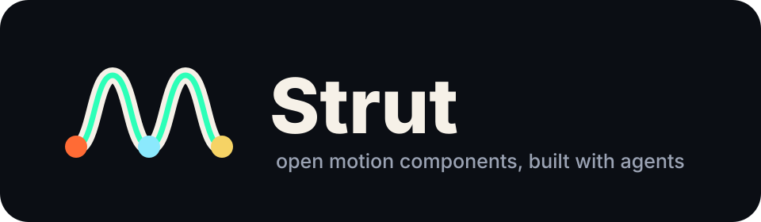
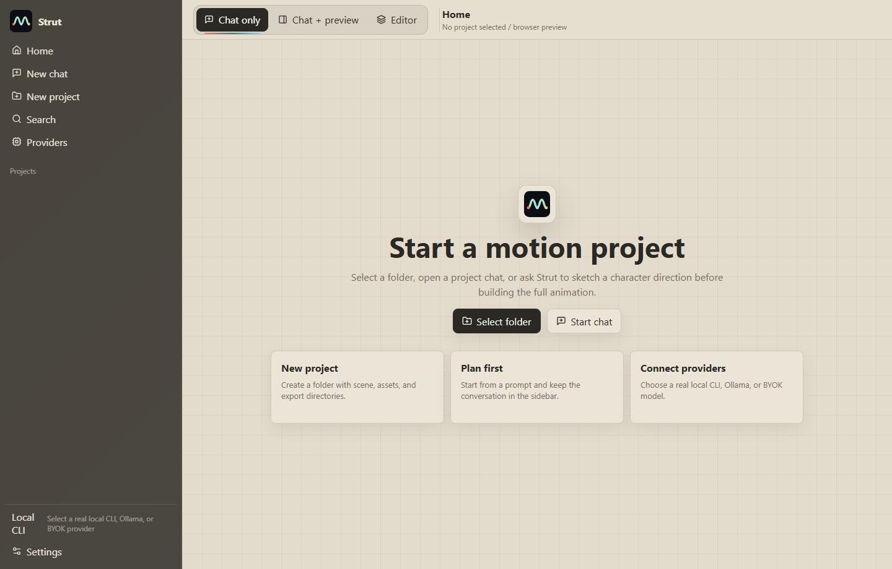
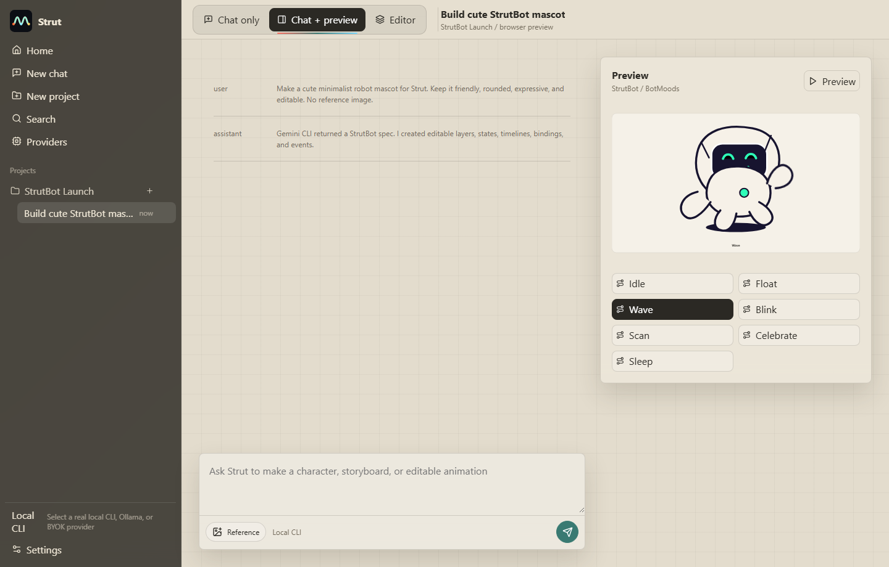
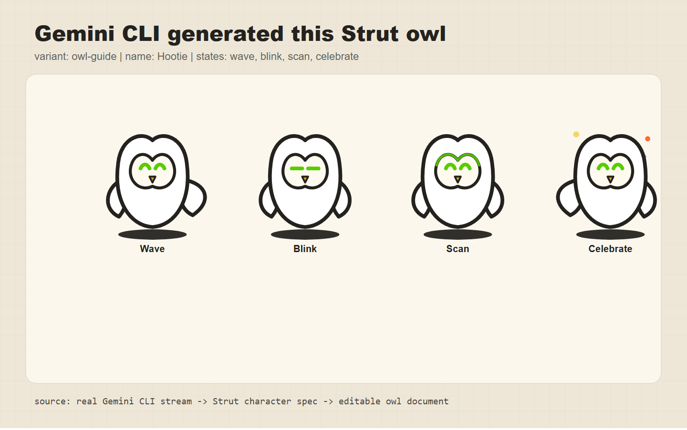
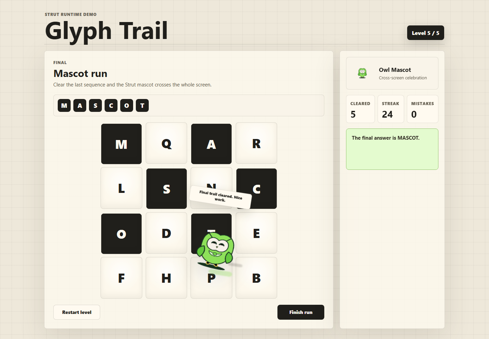

<p align="center">
  
</p>

# Strut

Strut is an open-source, desktop-first motion design studio for interactive product graphics. It is built around an open `.strut` format, a fast Rust core, GPU-backed previews, and an AI-native workflow that can turn prompts, SVGs, images, or rough sketches into editable runtime-ready animation components.

Strut is not trying to be a free copy of any single tool. The goal is a local-first motion IDE where designers and engineers can create, verify, export, and automate interactive animation systems without locking their work into a closed editor.

> Status: pre-alpha. The repository is being scaffolded. APIs, file schemas, and runtime contracts will change while the MVP is built.

## Screenshots And Generations

<table>
  <tr>
    <td width="50%">
      
      <br>
      <strong>Studio home</strong>
    </td>
    <td width="50%">
      
      <br>
      <strong>AI chat with editable preview</strong>
    </td>
  </tr>
  <tr>
    <td width="50%">
      
      <br>
      <strong>Gemini CLI generated mascot states</strong>
    </td>
    <td width="50%">
      
      <br>
      <strong>Runtime game animation</strong>
    </td>
  </tr>
</table>

## Why Strut

- **Open format**: `.strut` files are documented, inspectable, versioned, and designed for long-term portability.
- **Desktop only**: first-class Windows, macOS, and Linux apps instead of a web SaaS dependency.
- **Rust-fast core**: parsing, validation, compilation, state machines, and render preparation live in Rust.
- **Local GPU support**: viewport/rendering architecture is designed around `wgpu`, WebGPU, Metal, DirectX 12, and Vulkan paths with CPU fallback where needed.
- **AI first, BYOK**: users can bring OpenAI, Anthropic, Gemini, OpenRouter, Ollama, LM Studio, Azure OpenAI, or any OpenAI-compatible endpoint.
- **Agent compatible**: Strut can orchestrate local coding agents such as Codex, Claude Code, Gemini CLI, Antigravity, Kiro, Copilot CLI, OpenCode, Cursor-style agents, and custom adapters.
- **Mockup to model**: SVGs are parsed deterministically; raster mockups use vision plus classical geometry extraction to create editable Strut scenes.
- **Plan Mode**: when there is no mockup, Strut sketches multiple 2D directions first, waits for review, then builds the full animation.
- **Runtime ready**: exported components are designed to be controlled by app code through stable inputs, bindings, and events.

## Product Shape

```txt
Strut Studio       desktop editor and AI workspace
Strut Format       open .strut project/runtime format
Strut Runtime      embeddable playback libraries
Strut Agent Engine BYOK provider router and local agent orchestration
Strut Verifier     render, state-machine, export, and performance checks
Strut MCP          controlled project access for external agents
```

## Documentation

Start with the public docs:

- [What Is Strut?](./docs/learn/what-is-strut.md)
- [Quick Start](./docs/learn/quick-start.md)
- [Create Your First Animation](./docs/learn/first-animation.md)
- [Plan Mode](./docs/learn/plan-mode.md)
- [Generate A Character](./docs/guides/generate-a-character.md)
- [AI And Providers](./docs/learn/ai-and-providers.md)

Contributor and milestone review notes live in [docs/internal](./docs/internal/README.md).

## Repository Layout

```txt
apps/
  studio/                 Tauri desktop app
crates/
  strut-core/             scene graph, timelines, state machines
  strut-format/           .strut read/write/validate
  strut-renderer/         GPU renderer abstraction
  strut-compiler/         editable project -> optimized runtime artifact
  strut-agent/            provider router and agent orchestration
  strut-verifier/         snapshot, export, and state checks
packages/
  runtime-web/            browser runtime
  runtime-react/          React wrapper
docs/                     public docs, guides, reference, maintainer notes
assets/                   brand and documentation assets
```

## Development

The current scaffold uses:

```txt
Rust 1.93+
Node.js 25+
npm 11+
Tauri v2
TypeScript
React
wgpu
SQLite
```

Standard commands:

```powershell
npm install
npm run check
npm run test
npm run studio:dev
```

Maintainer review commands live in [docs/internal/manual-review.md](./docs/internal/manual-review.md).

## License

Apache-2.0. See [LICENSE](./LICENSE).
